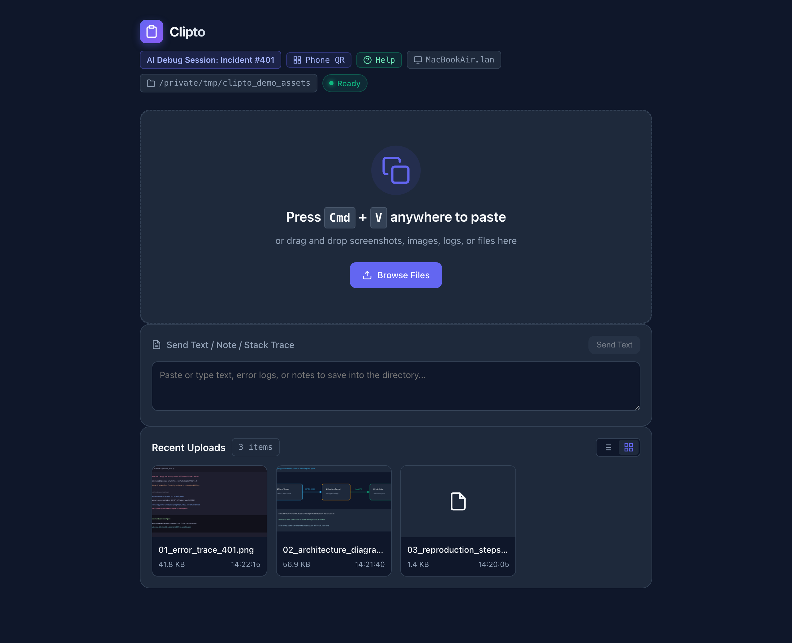
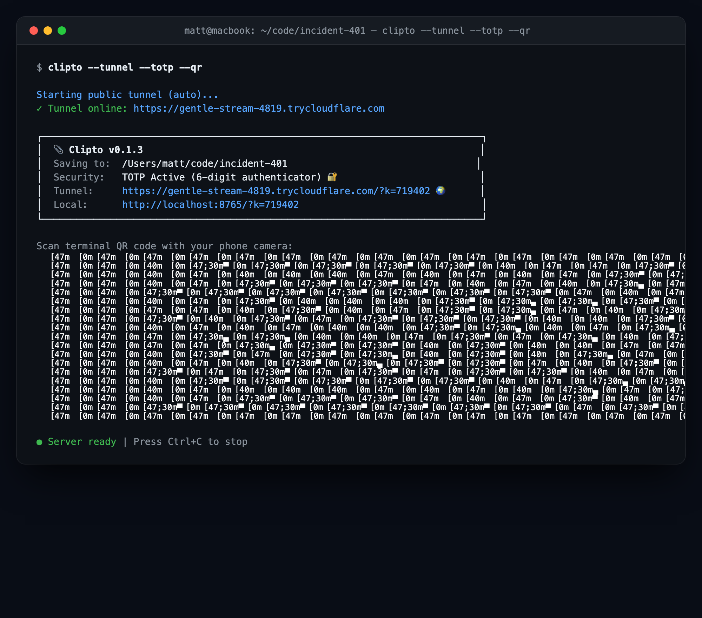
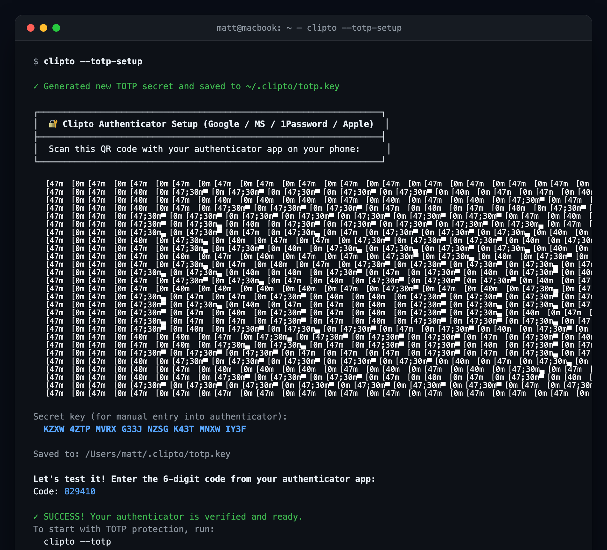
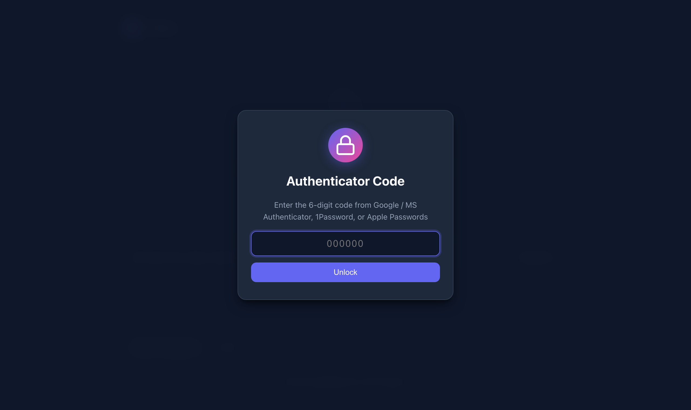
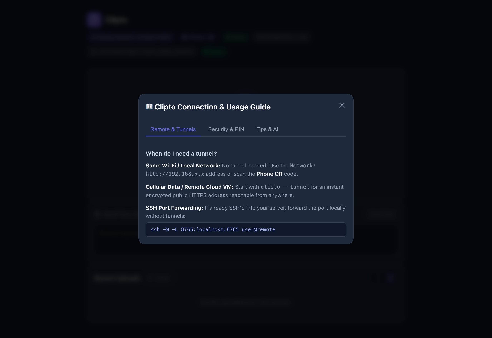
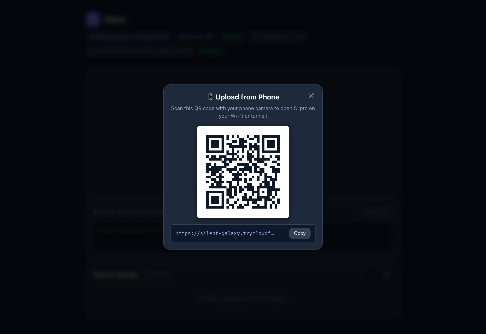

# 📎 Clipto

[](https://pypi.org/project/clipto/)
[](LICENSE)
[](https://github.com/mattintech/clipto/actions/workflows/ci.yml)

> **Instant clipboard, screenshot, and file bridge from your browser or phone to your terminal/remote server.**

Ever run an AI agent, Docker container, or SSH session on a remote server, but need to get a screenshot or log file from your local machine to that server? 

**Clipto** solves this. Run `clipto` in any directory on your machine or remote server, open the link in your browser, and hit **Cmd+V / Ctrl+V**. Your screenshot or clipboard contents are immediately saved right into that folder.

<p align="center">
  
</p>

---

## ✨ Features

- **⚡ Zero-Click Paste:** Open the page and press `Cmd+V` or `Ctrl+V` anywhere. No buttons or input selection required.
- **🖼️ Thumbnail Grid & Lightbox:** Visual thumbnail cards with click-to-enlarge full-screen preview.
- **🚇 Public HTTPS Tunnels (`--tunnel`):** Instant, secure internet access from cellular or remote servers via Cloudflare Quick Tunnels.
- **📱 Phone QR Code (`--qr`):** Print a high-contrast terminal QR code or click "Phone QR" in the web UI to snap and upload from your phone camera.
- **🔐 Authenticator App TOTP (`--totp` / `--totp-setup`):** 6-digit rolling codes with Google Authenticator, Microsoft Authenticator, 1Password, or Apple Passwords.
- **🔒 PIN & Password Protection (`--pin` / `--pass`):** Protect access with an auto-generated 4-digit PIN or custom passphrase (auto-enabled on `--tunnel`).
- **📖 Built-in Guides (`--help-tunnel`):** Help modal right in the browser and CLI cheat sheets for remote connections.
- **🎯 Drag & Drop:** Drop multiple files, images, or documents straight onto the window.
- **📝 Text & Note Box:** Paste stack traces, error logs, or notes to save directly as `.txt` files.
- **🤖 AI Agent Friendly (`--once`):** One-shot mode spins up the server, waits for an upload, writes the file, prints the saved path to `stdout`, and exits cleanly.
- **🔀 Smart Port Hunting:** Automatically picks the next free port (`8765`, `8766`, etc.) so multiple instances never collide.
- **🏷️ Multi-Instance Context:** The UI prominently shows the host machine, target directory, and optional custom `--title`.
- **🪶 Zero Dependencies:** Powered purely by Python's standard library. Installs in milliseconds with zero dependency conflicts.

---

## 🚀 Quick Start

### Installation

```bash
pip install clipto
```

### Basic Usage

Run `clipto` in whichever directory you want files to land:

```bash
clipto
```

Pass `-o / --open` to automatically launch your browser, or `-q / --qr` to display a terminal QR code:

```bash
clipto --tunnel --totp --qr
```

<p align="center">
  
</p>

1. Open the URL in your browser (or scan the terminal QR code with your phone).
2. Hit `Cmd+V` to paste a screenshot, or drag files onto the page.
3. The files are instantly written to your current directory!

---

## 🔐 Authenticator (TOTP) Setup & Usage

To use Google Authenticator, Microsoft Authenticator, 1Password, or Apple Passwords:

### Step 1: One-Time Setup

```bash
clipto --totp-setup
```

Clipto generates a secure 160-bit key in `~/.clipto/totp.key` (`0600` permissions) and displays a terminal QR code. Scan it with your phone's authenticator app:

<p align="center">
  
</p>

### Step 2: Running with TOTP Protection

```bash
clipto --totp
# or combined with an encrypted public tunnel:
clipto --tunnel --totp
```

* **Zero-Typing For You:** The terminal link and QR code include the active 30-second token (`?k=CODE`), logging you in automatically.
* **Locked For Outsiders:** Anyone connecting without the token hits a clean 6-digit authenticator lock screen:

<p align="center">
  
</p>

---

## 🚇 Remote Access & Public Tunneling

```bash
clipto --tunnel
```

Clipto launches an encrypted, free public HTTPS tunnel via Cloudflare Quick Tunnels.

* **Zero-Typing For You:** The tunnel link and QR code already contain your auth token (`?k=PIN`), logging you in automatically.
* **Locked For Everyone Else:** Anyone discovering your public tunnel URL hits a clean PIN lock screen.
* **Built-in Remote Guide:** Run `clipto --help-tunnel` or click **`[ ❓ Help ]`** in the web UI for interactive cheat sheets on Cloudflare tunnels, Tailscale / WireGuard, and SSH local port forwarding (`ssh -L`):

<p align="center">
  
</p>

---

## 📱 Mobile Uploads

Upload photos, documents, or screenshots directly from your mobile phone:

```bash
clipto --qr
# or with a public tunnel:
clipto --tunnel --qr
```

A QR code is rendered directly in your terminal. You can also click **`[ 📱 Phone QR ]`** in the web header at any time to display the QR code on your desktop screen:

<p align="center">
  
</p>

### PIN & Password Protection

```bash
# Auto-generate a 4-digit PIN:
clipto --pin

# Or use your own password:
clipto --pass secret123
```

---

## 🤖 Using with AI Agents & Scripts

```bash
# Agent or script runs this:
FILE_PATH=$(clipto --once --title "Submit bug screenshot" --timeout 120)

echo "Agent received file at: $FILE_PATH"
```

The agent gets the exact file path back into its visual/multimodal context!

---

## ⚙️ CLI Reference

```text
usage: clipto [-h] [-v] [-p PORT] [--no-hunt] [-d DIR] [-1] [-t TITLE] [-o] [-q] [--pin] [--pass PASSWORD] [--totp] [--totp-setup] [--tunnel [TUNNEL]] [--help-tunnel] [--host HOST] [--timeout TIMEOUT]

Instant clipboard, screenshot, and file bridge from browser to terminal.

options:
  -h, --help            show this help message and exit
  -v, --version         show program's version number and exit
  -p PORT, --port PORT  Port to listen on (default: 8765; use 0 for random).
  --no-hunt             Disable automatic port hunting if port is busy.
  -d DIR, --dir DIR     Target directory to save files (default: .).
  -1, --once            One-shot mode: exit after upload and print file path(s).
  -t TITLE, --title TITLE
                        Custom session title or prompt shown in the UI header.
  -o, --open            Automatically open web UI in default browser on launch.
  -q, --qr              Display a terminal QR code for the network/tunnel URL.
  --pin                 Protect access with an auto-generated 4-digit PIN.
  --pass PASSWORD       Protect access with a custom password.
  --totp                Protect access with a standard 6-digit TOTP Authenticator code.
  --totp-setup          Initialize or configure TOTP Authenticator with a terminal QR code.
  --tunnel [TUNNEL]     Expose server over an encrypted public HTTPS tunnel.
  --help-tunnel         Show guide on tunneling and remote connections.
  --host HOST           Host to bind to (default: 0.0.0.0).
  --timeout TIMEOUT     Timeout in seconds (useful with --once).
```

---

## 📄 License

MIT © Matt
