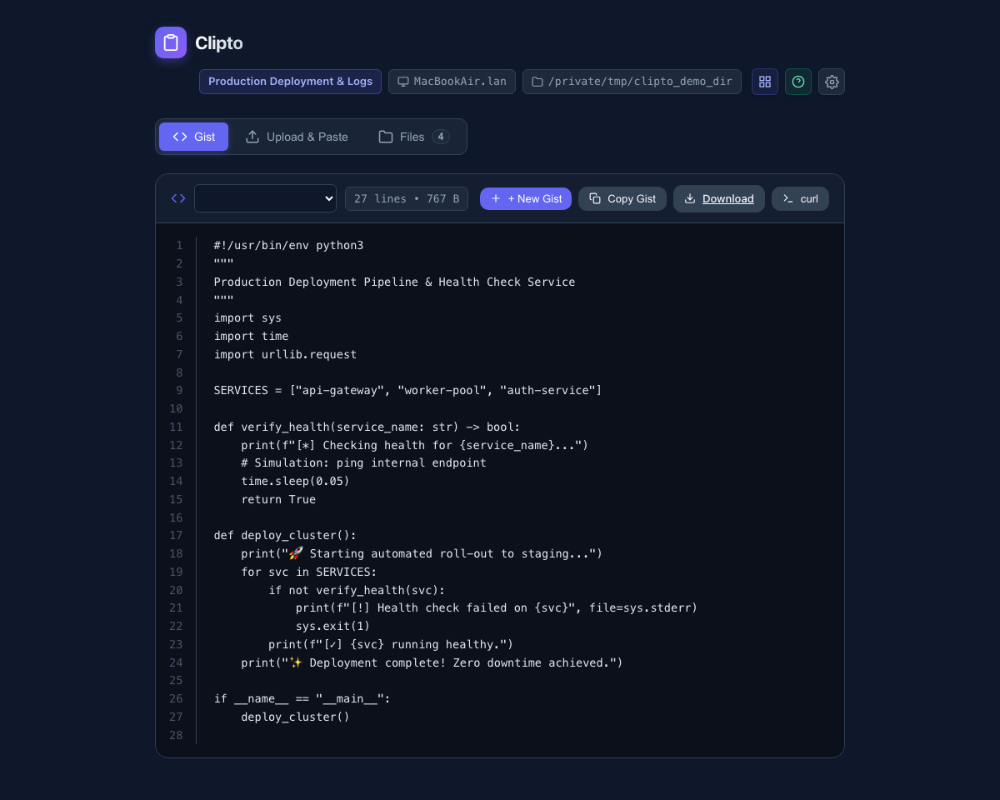
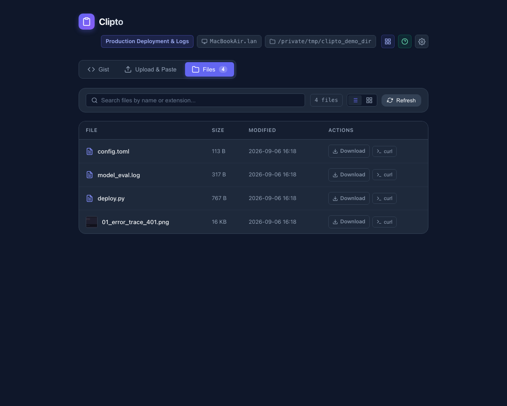

# 📎 Clipto

[](https://pypi.org/project/clipto/)
[](LICENSE)
[](https://github.com/mattintech/clipto/actions/workflows/ci.yml)

> **Instant clipboard, screenshot, and file bridge from your browser or phone to your terminal/remote server.**

Ever run an AI agent, Docker container, or SSH session on a remote server, but need to get a screenshot or log file from your local machine to that server? 

**Clipto** solves this. Run `clipto` in any directory on your machine or remote server, open the link in your browser, and hit **Cmd+V / Ctrl+V**. Your screenshot or clipboard contents are immediately saved right into that folder.

<p align="center">
  
</p>

---

## ✨ Features

- **⚡ Zero-Click Paste:** Open the page and press `Cmd+V` or `Ctrl+V` anywhere. No buttons or input selection required.
- **📄 Interactive Private Gists:** Dedicated Gist tab with an in-browser `+ New Gist` creator, code viewer with line numbers, 1-click raw clipboard copy, and direct `curl` download commands.
- **📁 Files Browser (Grid & List View):** Switch between a compact file table and visual card grid with image thumbnails, file previews, and instant search filtering.
- **⚙️ Settings & Tab Customization (<kbd>Cmd+,</kbd> / <kbd>Ctrl+,</kbd>):** Reorder tabs (e.g. `Gist | Upload & Paste | Files`) to fit your workflow, saved automatically to global config (`~/.clipto/config.json`).
- **🎯 Streamlined Icon Action Bar:** 1-click header buttons to copy target directory path, copy host name, open phone QR modal, access connection help, and configure settings.
- **⚡ 1-Click `curl` Commands:** Copy direct `curl` commands from the terminal banner or web UI to pipe files directly to remote servers or terminal sessions.
- **🖼️ Thumbnail Grid & Lightbox:** Visual thumbnail cards with click-to-enlarge full-screen preview.
- **🚇 Public HTTPS Tunnels (`--tunnel`):** Instant, secure internet access from cellular or remote servers via Cloudflare Quick Tunnels.
- **🔒 Direct HTTPS & Self-Signed Certs (`--self-signed` / `--cert`):** Enable local HTTPS with automatic SANs and HTTP-to-HTTPS redirect for full remote clipboard read & write access.
- **📱 Phone QR Code (`--qr`):** Print a high-contrast terminal QR code or click "Phone QR" in the web UI to snap and upload from your phone camera.
- **🔐 Authenticator App TOTP (`--totp` / `--totp-setup`):** 6-digit rolling codes with Google Authenticator, Microsoft Authenticator, 1Password, or Apple Passwords.
- **🔒 PIN & Password Protection (`--pin` / `--pass`):** Protect access with an auto-generated 4-digit PIN or custom passphrase (auto-enabled on `--tunnel`).
- **📖 Built-in Guides (`--help-tunnel`):** Help modal right in the browser and CLI cheat sheets for remote connections.
- **🎯 Drag & Drop:** Drop multiple files, images, or documents straight onto the window.
- **📝 Text & Note Box:** Paste stack traces, error logs, or notes to save directly as `.txt` files.
- **🤖 AI Agent Friendly (`--once`):** One-shot mode spins up the server, waits for an upload or file delivery, writes/streams the file, and exits cleanly.
- **🔀 Smart Port Hunting:** Automatically picks the next free port (`8765`, `8766`, etc.) so multiple instances never collide.
- **🏷️ Multi-Instance Context:** The UI prominently shows the host machine, target directory, and optional custom `--title`.
- **🪶 Zero Dependencies:** Powered purely by Python's standard library. Installs in milliseconds with zero dependency conflicts.

---

## 🚀 Quick Start

### Installation

```bash
pip install clipto
```

### Basic Usage

Run `clipto` in whichever directory you want files to land:

```bash
clipto
```

Pass `-o / --open` to automatically launch your browser, or `-q / --qr` to display a terminal QR code:

```bash
clipto --tunnel --totp --qr
```

<p align="center">
  
</p>

1. Open the URL in your browser (or scan the terminal QR code with your phone).
2. Hit `Cmd+V` to paste a screenshot, or drag files onto the page.
3. The files are instantly written to your current directory!

---

## 📂 Private Gists & File Sharing

Clipto isn't just an inbound receiver—it's also an instant outbound file server and private Gist bridge!

### 1. Share a Specific File or Binary

```bash
# Share a script as a private Gist:
clipto share deploy.sh

# Or share a compiled binary / archive:
clipto share release-v1.0.tar.gz

# Shortcut syntax:
clipto my_script.py
```

Clipto formats a direct `curl` command right in the terminal banner:
```text
┌────────────────────────────────────────────────────────────────────────┐
│ 📎 Clipto v0.2.0 [SHARING FILE]                                        │
│ File:       deploy.sh (3.2 KB)                                         │
│ Directory:  /Users/matt/code/project                                   │
│ Config:     /Users/matt/.clipto/config.json                            │
│ Local:      http://localhost:8765                                      │
│ Network:    http://192.168.1.100:8765                                  │
│ Curl (CLI): curl -sSL "http://localhost:8765/raw/deploy.sh" -o deploy.sh│
└────────────────────────────────────────────────────────────────────────┘
```

On any remote machine or terminal session, simply paste that `curl` command to download the file directly!

### 2. One-Shot Delivery (`--once`)

Combine `share` with `--once` to serve the file exactly once and terminate immediately upon delivery:

```bash
clipto share app-binary --once
```

### 3. Interactive Private Gists & Code Viewer

Click the **Gist** tab to view, create, and share private code snippets:
* **`+ New Gist` Creator:** Click `+ New Gist` to draft code, select syntax or filename, and save immediately.
* **Line Numbers & 1-Click Copy:** View clean code with line numbers, click **Copy Gist** to copy raw content to your clipboard, or trigger direct browser downloads.
* **1-Click `curl` Command:** Copy direct `curl` commands to pipe or download scripts on any remote machine.

<p align="center">
  
</p>

### 4. Files Browser (Grid & List View)

Click the **Files** tab to browse everything in the active directory:
* **Grid & List Views:** Toggle between a compact file table and a responsive card grid with image thumbnails and document previews.
* **Direct Downloads & curl:** Download any file with a single click or copy CLI curl commands.
* **Instant Search Filter:** Real-time search by filename or extension.

<p align="center">
  
</p>

### 5. Settings & Tab Customization

Press <kbd>Cmd+,</kbd> (Mac) or <kbd>Ctrl+,</kbd> (Windows/Linux)—or click the gear icon (`⚙️`) in the top right header—to open the **Settings** modal:
* **Custom Tab Order:** Reorder your segmented tabs (e.g. `Gist | Upload & Paste | Files` or `Files | Gist`) using interactive up/down controls.
* **Global Configuration:** Preferences are automatically saved in `~/.clipto/config.json`. The active path is displayed in both the settings modal and the startup terminal banner.

---

## 🔐 Authenticator (TOTP) Setup & Usage

To use Google Authenticator, Microsoft Authenticator, 1Password, or Apple Passwords:

### Step 1: One-Time Setup

```bash
clipto --totp-setup
```

Clipto generates a secure 160-bit key in `~/.clipto/totp.key` (`0600` permissions) and displays a terminal QR code. Scan it with your phone's authenticator app:

<p align="center">
  
</p>

### Step 2: Running with TOTP Protection

```bash
clipto --totp
# or combined with an encrypted public tunnel:
clipto --tunnel --totp
```

* **Zero-Typing For You:** The terminal link and QR code include the active 30-second token (`?k=CODE`), logging you in automatically.
* **Locked For Outsiders:** Anyone connecting without the token hits a clean 6-digit authenticator lock screen:

<p align="center">
  
</p>

---

## 🚇 Remote Access & Public Tunneling

```bash
clipto --tunnel
```

Clipto launches an encrypted, free public HTTPS tunnel via Cloudflare Quick Tunnels.

* **Zero-Typing For You:** The tunnel link and QR code already contain your auth token (`?k=PIN`), logging you in automatically.
* **Locked For Everyone Else:** Anyone discovering your public tunnel URL hits a clean PIN lock screen.
* **Built-in Remote Guide:** Run `clipto --help-tunnel` or click **`[ ❓ Help ]`** in the web UI for interactive cheat sheets on Cloudflare tunnels, Tailscale / WireGuard, and SSH local port forwarding (`ssh -L`):

<p align="center">
  
</p>

---

## 🔒 Direct HTTPS & Remote Clipboard Access

Modern browsers (Chrome, Safari, Firefox) restrict programmatic clipboard reading (`navigator.clipboard.readText()`) to **Secure Contexts** (HTTPS or `localhost`). When connecting over plain HTTP across your local Wi-Fi or Tailscale network (e.g. `http://192.168.1.100:8765`), browsers block clipboard reading for privacy.

Clipto solves this with zero configuration:

```bash
# Auto-generate a self-signed TLS cert with Subject Alternative Names (SAN):
clipto --self-signed

# Or pass your own existing certificate and key:
clipto --cert /path/to/cert.pem --key /path/to/key.pem
```

* Clipto generates an SSL certificate stored in `~/.clipto/clipto.crt` with SANs matching `localhost`, `127.0.0.1`, your local LAN IP, and Tailscale IP.
* When clicking **Copy** or **Paste from Clipboard** in the UI, if the connection is insecure, Clipto displays a clean `Failed to copy/paste to clipboard (?)` toast. Clicking that toast opens an in-depth explanation modal detailing why and showing how to enable HTTPS or use keyboard shortcuts (<kbd>Cmd+V</kbd> / <kbd>Ctrl+V</kbd>).

---

## 📱 Mobile Uploads

Upload photos, documents, or screenshots directly from your mobile phone:

```bash
clipto --qr
# or with a public tunnel:
clipto --tunnel --qr
```

A QR code is rendered directly in your terminal. You can also click **`[ 📱 Phone QR ]`** in the web header at any time to display the QR code on your desktop screen:

<p align="center">
  
</p>

### PIN & Password Protection

```bash
# Auto-generate a 4-digit PIN:
clipto --pin

# Or use your own password:
clipto --pass secret123
```

---

## 🤖 Using with AI Agents & Scripts

```bash
# Agent or script runs this:
FILE_PATH=$(clipto --once --title "Submit bug screenshot" --timeout 120)

echo "Agent received file at: $FILE_PATH"
```

The agent gets the exact file path back into its visual/multimodal context!

---

## ⚙️ CLI Reference

```text
usage: clipto [-h] [-v] [-p PORT] [--no-hunt] [-d DIR] [-1] [-t TITLE] [-o]
              [-q] [--pin] [--pass PASSWORD] [--totp] [--totp-setup]
              [--tunnel [TUNNEL]] [--self-signed] [--cert CERT] [--key KEY]
              [--help-tunnel] [--host HOST] [--timeout TIMEOUT]
              [share_args ...]

Instant clipboard, screenshot, and file bridge from browser to terminal.

positional arguments:
  share_args            Optional: 'share [path]' or path to share a specific file or directory.

options:
  -h, --help            show this help message and exit
  -v, --version         show program's version number and exit
  -p PORT, --port PORT  Port to listen on (default: 8765; use 0 for random).
  --no-hunt             Disable automatic port hunting if port is busy.
  -d DIR, --dir DIR     Target directory to save files (default: .).
  -1, --once            One-shot mode: exit after upload and print file path(s).
  -t TITLE, --title TITLE
                        Custom session title or prompt shown in the UI header.
  -o, --open            Automatically open web UI in default browser on launch.
  -q, --qr              Display a terminal QR code for the network/tunnel URL.
  --pin                 Protect access with an auto-generated 4-digit PIN.
  --pass PASSWORD       Protect access with a custom password.
  --totp                Protect access with a standard 6-digit TOTP Authenticator code.
  --totp-setup          Initialize or configure TOTP Authenticator with a terminal QR code.
  --tunnel [TUNNEL]     Expose server over an encrypted public HTTPS tunnel.
  --self-signed         Enable direct HTTPS with an auto-generated self-signed certificate.
  --cert CERT           Path to custom TLS certificate (.crt or .pem) to enable HTTPS.
  --key KEY             Path to custom TLS private key (.key or .pem).
  --help-tunnel         Show guide on tunneling and remote connections.
  --host HOST           Host to bind to (default: 0.0.0.0).
  --timeout TIMEOUT     Timeout in seconds (useful with --once).
```

---

## 📄 License

MIT © Matt Hills (MattInTech)
